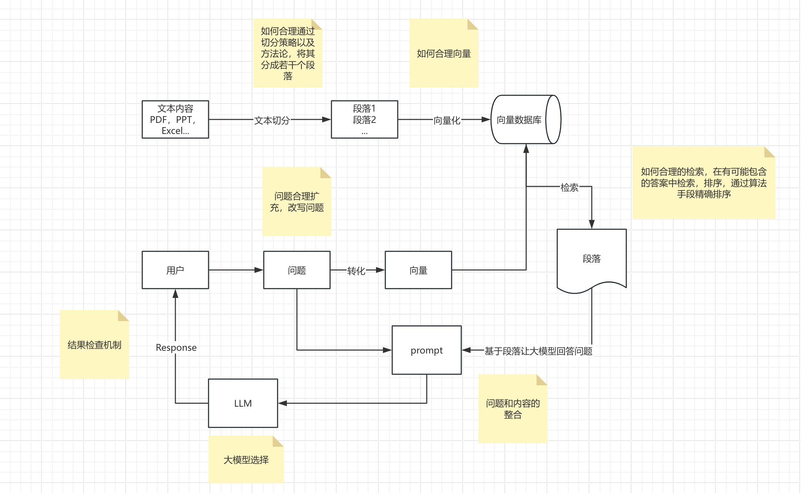

# ExileChat

## AI知识库 - RAG流程基础功能实现

- 基于`FastApi`与`tortoise-orm`等异步方式结合`openai`实现。



### 文档规整

- 当前仅支持`.docx`类型，后续补充`.pdf`等类型。

```python

# /ExileChat/test/test_ai/test_document_chunk.py

from utils.ai.document_chunk import DocumentChunk

if __name__ == "__main__":
    # 文档的路径或静态资源服务器的地址
    file_path = "/Users/yangyuexiong/Desktop/ExileChat/test/测试文档.docx"

    # 文档中图片存放的路径或图片服务器的地址,`image_base_path` 与 `image_base_url` 使用其一即可
    image_base_path = "/Users/yangyuexiong/Desktop/ExileChat/test/test_ai"
    image_base_url = "https://www.example.com"

    dc = DocumentChunk(image_base_path=image_base_path, is_debug=True)
    dc.process_file(file_path)
```

### 大模型调用

- 你需要查阅对应大模型的文档以及准备`api_key`，按照例子来使用它。
- 当前仅支持`OpenAI`，`AzureOpenAI`，`Moonshot`，当然你可以自行添加其他模型，你需要根据以下代码示例实现对应的初始化工作。

```python

# /ExileChat/utils/ai/llm_engine.py 

# 代码片段
class ModelClient:# ExileChat

## AI知识库 - RAG流程基础功能实现

- 基于`FastApi`与`tortoise-orm`等异步方式结合`openai`实现。


### 文档规整

- 当前仅支持`.docx`类型，后续补充`.pdf`等类型。

```python

# /ExileChat/test/test_ai/test_document_chunk.py

from utils.ai.document_chunk import DocumentChunk

if __name__ == "__main__":
    # 文档的路径或静态资源服务器的地址
    file_path = "/Users/yangyuexiong/Desktop/ExileChat/test/测试文档.docx"

    # 文档中图片存放的路径或图片服务器的地址,`image_base_path` 与 `image_base_url` 使用其一即可
    image_base_path = "/Users/yangyuexiong/Desktop/ExileChat/test/test_ai"
    image_base_url = "https://www.example.com"

    dc = DocumentChunk(image_base_path=image_base_path, is_debug=True)
    dc.process_file(file_path)
```

### 大模型调用

- 你需要查阅对应大模型的文档以及准备`api_key`，按照例子来使用它。
- 当前仅支持`OpenAI`，`AzureOpenAI`，`Moonshot`，当然你可以自行添加其他模型，你需要根据以下代码示例实现对应的初始化工作。

```python

# /ExileChat/utils/ai/llm_engine.py 

# 代码片段
class ModelClient:
    """Models Client"""

    api_key: str = None
    kwargs: dict = {}

    @classmethod
    def open_ai(cls):
        """OpenAI Client"""
        ...

    @classmethod
    def azure_open_ai(cls):
        """AzureOpenAI Client"""
        ...

    @classmethod
    def moonshot(cls):
        """Moonshot Client"""
        ...


# 代码片段
class LLMEngine:
    """Large Language Models Engine"""

    def __init__(self, model_name: str = None, api_key: str = None, is_debug: bool = False, *args, **kwargs):
        self.model_name = model_name
        self.api_key = api_key
        self.is_debug = is_debug
        self.args = args
        self.kwargs = kwargs

        ModelClient.api_key = api_key
        ModelClient.kwargs = kwargs
        self.client_dict = {
            "open_ai": ModelClient.open_ai,
            "azure_open_ai": ModelClient.azure_open_ai,
            "moonshot": ModelClient.moonshot,
        }
        ...

```
- 当然也提供了`websocket`与模型对话应答

```python

# /ExileChat/app/api/chat_ws/chat_ws.py

# 代码片段
# 把鉴权删除，替换模型与提示词即可。
# ws://0.0.0.0:7569/ws/chat
@chat_ws_router.websocket("/chat")
async def chat(websocket: WebSocket):
    """对话"""

    await websocket.accept()

    query_params = websocket.query_params
    token = query_params.get("token")
    chat_id = query_params.get("chat_id", None)

    user = await check_user(token)
    if not user:
        await websocket.close(code=status.WS_1008_POLICY_VIOLATION)
        print("鉴权验证失败 ws 关闭...")
        raise CustomException(status_code=403, detail="鉴权验证失败...", custom_code=10005)

    try:
        while True:
            data = await websocket.receive_text()
            await websocket.send_text(f"用户: {user} token: {token} 对话: {chat_id} 消息: {data}\n")

            llm_engine = LLMEngine(model_name='azure_open_ai', api_key=api_key)
            llm_engine.system_prompt = "你是一名Python专家"
            response_generator = llm_engine.chat(input=data)

            async for chunk in response_generator:
                if isinstance(chunk, str):
                    await sleep(0.1)
                    await websocket.send_text(chunk)
                else:
                    print(type(chunk), chunk)

            await websocket.close()
            break
    except Exception as e:
        print(f"WebSocket连接发生异常: {e}")
        await websocket.close()

```

#### 多轮对话，流式响应

```python

# /ExileChat/test/test_ai/test_llm_engine.py

import asyncio
from utils.ai.llm_engine import LLMEngine
from api_key import api_key


async def main():
    """main"""

    new_engine = LLMEngine(model_name='azure_open_ai', api_key=api_key)

    new_engine.system_prompt = "你是一名Python专家"
    response_generator = new_engine.chat(input="Python是什么时候诞生的")

    async for chunk in response_generator:
        if isinstance(chunk, str):
            print(f"Received: {chunk}")
        else:
            print(f"Received chunk type: {type(chunk)}, value: {chunk}")


if __name__ == "__main__":
    asyncio.run(main())
```

#### 一次对话，阻塞响应

- 你可以通过修改`stream`改变响应性方式。

```python

# /ExileChat/test/test_ai/test_llm_engine_only.py

import asyncio
from utils.ai.llm_engine import LLMEngine
from api_key import api_key


async def main():
    """main"""

    new_engine = LLMEngine(model_name='azure_open_ai', api_key=api_key)
    generated_message = await new_engine.chat_only(prompt="你是强大的人工智能", input="你是谁?")
    print(generated_message)


if __name__ == "__main__":
    asyncio.run(main())
```

#### 向量化例子

```python

import asyncio
from utils.ai.llm_engine import LLMEngine
from api_key import api_key


async def main():
    """main"""

    llm_engine = LLMEngine(model_name='azure_open_ai', api_key=api_key)

    question = "1+1等于多少"
    answer = "等于2"
    question_embedding = await llm_engine.embedding(text=question)
    answer_embedding = await llm_engine.embedding(text=answer)
    return question_embedding, answer_embedding


if __name__ == "__main__":
    asyncio.run(main())

```

### 生成向量化数据结构

- 组合使用：结合大模型生成QA段落并且向量化构造知识库数据。
- 你完全可以不需要理会我项目的表结构和业务逻辑，你得到最终向量化的数据结构，结合自身的业务即可。

```python

# /ExileChat/test/test_ai/test_document_vector.py

import asyncio

from api_key import api_key
from utils.ai.llm_engine import LLMEngine
from utils.ai.document_chunk import DocumentChunk
from utils.ai.document_vector import DocumentVector

"""
文档向量
1.接收已经处理好的文档字符串。

    通过`from utils.ai.document_chunk import DocumentChunk`文档规整生成文档字符串，当然你可以使用其他更好方式生成它。

2.接收大模型引擎`LLMEngine`实例，例如以下使用了`azure_open_ai`作为模型。
    
    llm_engine = LLMEngine(model_name='azure_open_ai', api_key=api_key, is_debug=is_debug)
    
3.使用`LLMEngine`结合`prompt`文档生成`chunks`，同时`self.chunks`也会被赋值，如果你需要自定义可以修改它`self.chunks=[...]`

    dv = DocumentVector(...)
    dv.gen_chunks()
    
    *.得到例如以下结构的数据，自定义时需要按照以下数据结构。
    [
        {
            "index": 1,
            "chunk": "段落1"
        },
        {
            "index": 2,
            "chunk": "段落2"
        }
        ...
    ]
    
4.使用`LLMEngine`结合`prompt`对段落生成`QA`，同时`self.qa`也会被赋值，如果你需要自定义可以修改它`self.qa=[...]`

    dv.gen_qa()
    
    *.得到例如以下结构的数据，自定义时需要按照以下数据结构。
    [
        {
            "Q": "什么是 Python 中的协程？",
            "A": "Python 中的协程是一种用于实现异步编程的机制，它允许程序在等待操作完成时挂起执行，从而可以执行其他任务。",
            "chunks": [
                "Python 中的协程是一种用于实现异步编程的机制，它允许程序在等待操作完成时挂起执行，从而可以执行其他任务。"
            ]
        },
        {
            "Q": "协程在 Python 中的作用是什么？",
            "A": "协程是 Python 语言中的一个特性，用于编写更高效和响应更快的代码。",
            "chunks": [
                "协程是 Python 语言中的一个特性，用于编写更高效和响应更快的代码。"
            ]
        },
        ...
    ]
    
5.生成`QA`向量。

    dv.gen_qa_vector()
    
    *.最终会得到一个组装好的对象列表，例如以下结构的数据。
    [
        {
            'able_id': 0,
            'document_id': 0,
            'answer': '1+1等于2',
            'question': '1+1等于几？',
            'chunks': ["1+1=2", "..."],
            'answer_embedding': [0.02715362422168255, -0.010939446277916431, 0.006153851747512817, -0.009505090303719044, ...],
            'question_embedding': [0.02715362422168255, -0.010939446277916431, 0.006153851747512817, -0.009505090303719044, ...],
        },
        ...
    ]
"""
if __name__ == '__main__':
    is_debug = True
    # 为何测试问答的精准，我使用了我的毕业论文作为测试，hhh。
    # 你可以把下面 document_content = "1+1=2" 注释打开来进行测试。
    # file_path = "/Users/yangyuexiong/Desktop/ExileChat/test/基于Python+Vue自动化测试平台的设计与实现.docx"
    file_path = "/Users/yangyuexiong/Desktop/ExileChat/test/测试文档分段.docx"
    dc = DocumentChunk(image_base_path="/Users/yangyuexiong/Desktop/ExileChat/test/test_ai", is_debug=is_debug)
    document_content = dc.process_file(file_path)

    # document_content = "1+1=2"

    llm_engine = LLMEngine(model_name='azure_open_ai', api_key=api_key, is_debug=is_debug)
    dv = DocumentVector(document_content=document_content, llm_engine=llm_engine, is_debug=is_debug)
    asyncio.run(dv.gen_chunks())
    asyncio.run(dv.gen_qa())
    asyncio.run(dv.gen_qa_vector())

```

### 向量化应答

- 问题向量化通过数据库检索得到向量距离最相近的答案，结合大模型生成应答。
- `补充中...`


    """Models Client"""

    api_key: str = None
    kwargs: dict = {}

    @classmethod
    def open_ai(cls):
        """OpenAI Client"""
        ...

    @classmethod
    def azure_open_ai(cls):
        """AzureOpenAI Client"""
        ...

    @classmethod
    def moonshot(cls):
        """Moonshot Client"""
        ...


# 代码片段
class LLMEngine:
    """Large Language Models Engine"""

    def __init__(self, model_name: str = None, api_key: str = None, is_debug: bool = False, *args, **kwargs):
        self.model_name = model_name
        self.api_key = api_key
        self.is_debug = is_debug
        self.args = args
        self.kwargs = kwargs

        ModelClient.api_key = api_key
        ModelClient.kwargs = kwargs
        self.client_dict = {
            "open_ai": ModelClient.open_ai,
            "azure_open_ai": ModelClient.azure_open_ai,
            "moonshot": ModelClient.moonshot,
        }
        ...

```
- 当然也提供了`websocket`与模型对话应答

```python

# /Users/yangyuexiong/Desktop/ExileChat/app/api/chat_ws/chat_ws.py

# 代码片段
# 把鉴权删除，替换模型与提示词即可。
@chat_ws_router.websocket("/{token}/{chat_id}")
async def chat(websocket: WebSocket, token: str, chat_id: str, user: dict = Depends(check_user)):
    """对话"""

    await websocket.accept()

    if not user:
        await websocket.close(code=status.WS_1008_POLICY_VIOLATION)
        print("鉴权验证失败 ws 关闭...")
        raise CustomException(status_code=403, detail="鉴权验证失败...", custom_code=10005)

    try:
        while True:
            data = await websocket.receive_text()
            # await websocket.send_text(f"chat_id: {chat_id} 用户: {user} token: {token} 消息: {data}")

            # 测试代码
            llm_engine = LLMEngine(model_name='azure_open_ai', api_key=api_key)
            llm_engine.system_prompt = "你是一名Python专家"
            response_generator = llm_engine.chat(input=data)

            async for chunk in response_generator:
                if isinstance(chunk, str):
                    await websocket.send_text(chunk)
                else:
                    print(type(chunk), chunk)

            await websocket.close()
            break
    except Exception as e:
        print(f"WebSocket连接发生异常: {e}")
        await websocket.close()

```

#### 多轮对话，流式响应

```python

# /ExileChat/test/test_ai/test_llm_engine.py

import asyncio
from utils.ai.llm_engine import LLMEngine
from api_key import api_key


async def main():
    """main"""

    new_engine = LLMEngine(model_name='azure_open_ai', api_key=api_key)

    new_engine.system_prompt = "你是一名Python专家"
    response_generator = new_engine.chat(input="Python是什么时候诞生的")

    async for chunk in response_generator:
        if isinstance(chunk, str):
            print(f"Received: {chunk}")
        else:
            print(f"Received chunk type: {type(chunk)}, value: {chunk}")


if __name__ == "__main__":
    asyncio.run(main())
```

#### 一次对话，阻塞响应

- 你可以通过修改`stream`改变响应性方式。

```python

# /ExileChat/test/test_ai/test_llm_engine_only.py

import asyncio
from utils.ai.llm_engine import LLMEngine
from api_key import api_key


async def main():
    """main"""

    new_engine = LLMEngine(model_name='azure_open_ai', api_key=api_key)
    generated_message = await new_engine.chat_only(prompt="你是强大的人工智能", input="你是谁?")
    print(generated_message)


if __name__ == "__main__":
    asyncio.run(main())
```

#### 向量化例子

```python

import asyncio
from utils.ai.llm_engine import LLMEngine
from api_key import api_key


async def main():
    """main"""

    llm_engine = LLMEngine(model_name='azure_open_ai', api_key=api_key)

    question = "1+1等于多少"
    answer = "等于2"
    question_embedding = await llm_engine.embedding(text=question)
    answer_embedding = await llm_engine.embedding(text=answer)
    return question_embedding, answer_embedding


if __name__ == "__main__":
    asyncio.run(main())

```

### 生成向量化数据结构

- 组合使用：结合大模型生成QA段落并且向量化构造知识库数据。
- 你完全可以不需要理会我项目的表结构和业务逻辑，你得到最终向量化的数据结构，结合自身的业务即可。

```python

# /ExileChat/test/test_ai/test_document_vector.py

import asyncio

from api_key import api_key
from utils.ai.llm_engine import LLMEngine
from utils.ai.document_chunk import DocumentChunk
from utils.ai.document_vector import DocumentVector

"""
文档向量
1.接收已经处理好的文档字符串。

    通过`from utils.ai.document_chunk import DocumentChunk`文档规整生成文档字符串，当然你可以使用其他更好方式生成它。

2.接收大模型引擎`LLMEngine`实例，例如以下使用了`azure_open_ai`作为模型。
    
    llm_engine = LLMEngine(model_name='azure_open_ai', api_key=api_key, is_debug=is_debug)
    
3.使用`LLMEngine`结合`prompt`文档生成`chunks`，同时`self.chunks`也会被赋值，如果你需要自定义可以修改它`self.chunks=[...]`

    dv = DocumentVector(...)
    dv.gen_chunks()
    
    *.得到例如以下结构的数据，自定义时需要按照以下数据结构。
    [
        {
            "index": 1,
            "chunk": "段落1"
        },
        {
            "index": 2,
            "chunk": "段落2"
        }
        ...
    ]
    
4.使用`LLMEngine`结合`prompt`对段落生成`QA`，同时`self.qa`也会被赋值，如果你需要自定义可以修改它`self.qa=[...]`

    dv.gen_qa()
    
    *.得到例如以下结构的数据，自定义时需要按照以下数据结构。
    [
        {
            "Q": "什么是 Python 中的协程？",
            "A": "Python 中的协程是一种用于实现异步编程的机制，它允许程序在等待操作完成时挂起执行，从而可以执行其他任务。",
            "chunks": [
                "Python 中的协程是一种用于实现异步编程的机制，它允许程序在等待操作完成时挂起执行，从而可以执行其他任务。"
            ]
        },
        {
            "Q": "协程在 Python 中的作用是什么？",
            "A": "协程是 Python 语言中的一个特性，用于编写更高效和响应更快的代码。",
            "chunks": [
                "协程是 Python 语言中的一个特性，用于编写更高效和响应更快的代码。"
            ]
        },
        ...
    ]
    
5.生成`QA`向量。

    dv.gen_qa_vector()
    
    *.最终会得到一个组装好的对象列表，例如以下结构的数据。
    [
        {
            'able_id': 0,
            'document_id': 0,
            'answer': '1+1等于2',
            'question': '1+1等于几？',
            'chunks': ["1+1=2", "..."],
            'answer_embedding': [0.02715362422168255, -0.010939446277916431, 0.006153851747512817, -0.009505090303719044, ...],
            'question_embedding': [0.02715362422168255, -0.010939446277916431, 0.006153851747512817, -0.009505090303719044, ...],
        },
        ...
    ]
"""
if __name__ == '__main__':
    is_debug = True
    # 为何测试问答的精准，我使用了我的毕业论文作为测试，hhh。
    # 你可以把下面 document_content = "1+1=2" 注释打开来进行测试。
    # file_path = "/Users/yangyuexiong/Desktop/ExileChat/test/基于Python+Vue自动化测试平台的设计与实现.docx"
    file_path = "/Users/yangyuexiong/Desktop/ExileChat/test/测试文档分段.docx"
    dc = DocumentChunk(image_base_path="/Users/yangyuexiong/Desktop/ExileChat/test/test_ai", is_debug=is_debug)
    document_content = dc.process_file(file_path)

    # document_content = "1+1=2"

    llm_engine = LLMEngine(model_name='azure_open_ai', api_key=api_key, is_debug=is_debug)
    dv = DocumentVector(document_content=document_content, llm_engine=llm_engine, is_debug=is_debug)
    asyncio.run(dv.gen_chunks())
    asyncio.run(dv.gen_qa())
    asyncio.run(dv.gen_qa_vector())

```

### 向量化应答

- 问题向量化通过数据库检索得到向量距离最相近的答案，结合大模型生成应答。
- `补充中...`

